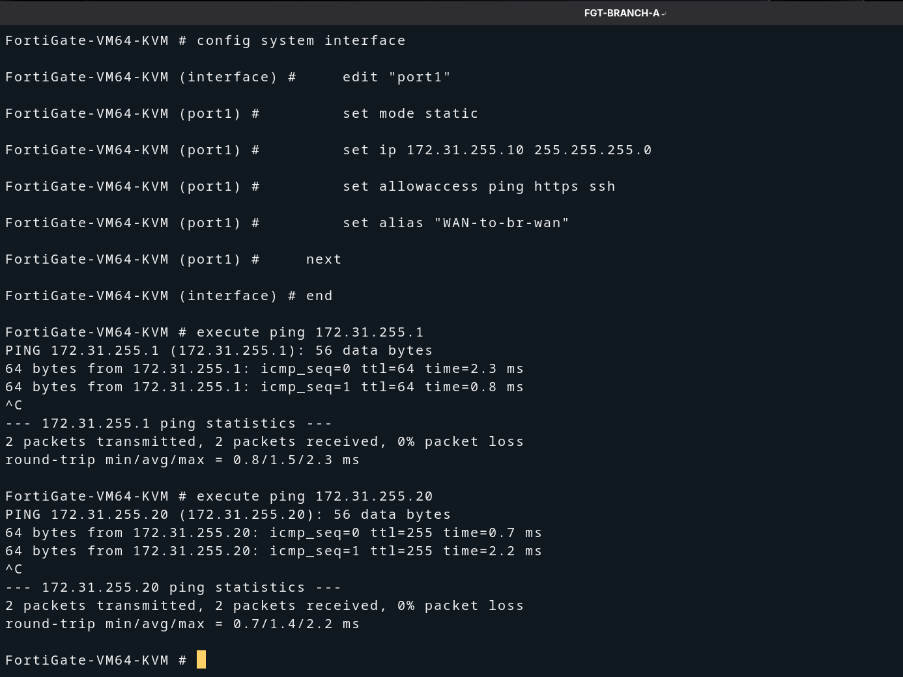
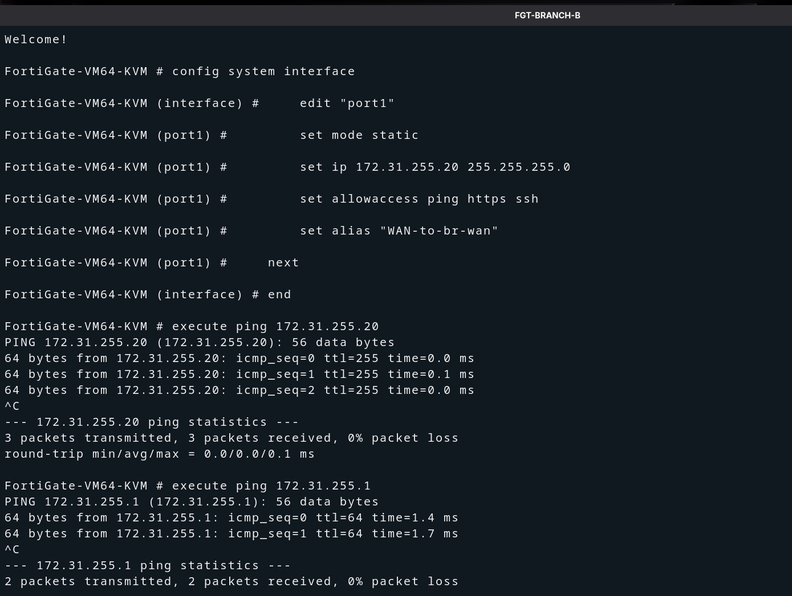
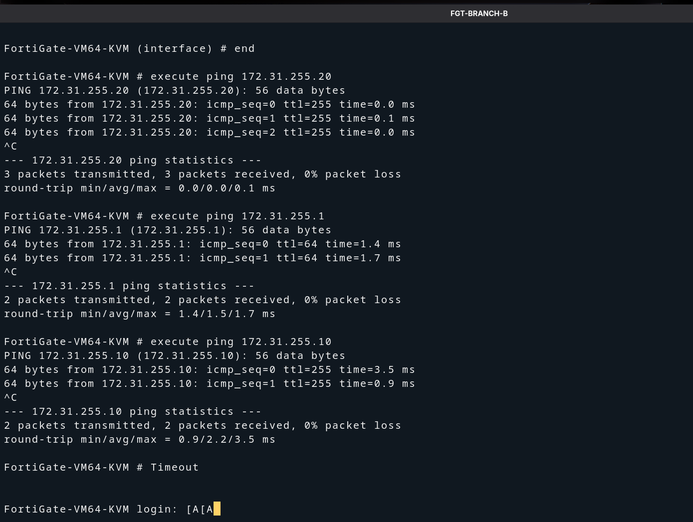

# FortiGate Basic WAN Configuration

## Overview

After the GNS3 topology is running, configure the WAN (`port1`) interface
on each FortiGate so both devices can reach the shared `br-wan` segment
and communicate with each other.

**Prerequisite:** Complete [00-gns3-topology.md](./00-gns3-topology.md) first.

---

## Addressing Summary

| Device       | Interface | IP Address       | Gateway      |
|--------------|-----------|------------------|--------------|
| FGT-BRANCH-A | port1     | 172.31.255.10/24 | 172.31.255.1 |
| FGT-BRANCH-B | port1     | 172.31.255.20/24 | 172.31.255.1 |
| Host bridge  | br-wan    | 172.31.255.1/24  | —            |

---

## Step 1 — Access the FortiGate Console

1. In GNS3, **right-click** `FGT-BRANCH-A` → **Console**.
2. A terminal window opens connected to the FortiGate CLI.
3. Log in with the default credentials:
   - **Username:** `admin`
   - **Password:** *(leave blank on first boot, press Enter)*

---

## Step 2 — Configure port1 on FGT-BRANCH-A

In the FGT-BRANCH-A console, run the following commands:

```
config system interface
    edit "port1"
        set mode static
        set ip 172.31.255.10 255.255.255.0
        set allowaccess ping https ssh
        set alias "WAN-to-br-wan"
    next
end
```

The screenshot below shows the full configuration being entered and both
ping tests run immediately after — to the gateway and to FGT-BRANCH-B:



**What the screenshot proves:**
- `set ip 172.31.255.10 255.255.255.0` — WAN IP assigned
- `execute ping 172.31.255.1` → **0% packet loss** — gateway reachable
- `execute ping 172.31.255.20` → **0% packet loss** — FGT-BRANCH-B reachable

---

## Step 3 — Configure port1 on FGT-BRANCH-B

Open the console for `FGT-BRANCH-B` and run:

```
config system interface
    edit "port1"
        set mode static
        set ip 172.31.255.20 255.255.255.0
        set allowaccess ping https ssh
        set alias "WAN-to-br-wan"
    next
end
```

The screenshot below shows the configuration being entered on FGT-BRANCH-B:



---

## Step 4 — Verify End-to-End Connectivity from FGT-BRANCH-B

From **FGT-BRANCH-B**, run pings to verify reachability in both directions:

```
execute ping 172.31.255.20   # ping its own WAN IP (loopback check)
execute ping 172.31.255.1    # ping the WAN gateway
execute ping 172.31.255.10   # ping FGT-BRANCH-A
```



**What the screenshot proves:**
- `execute ping 172.31.255.20` → **0% packet loss** — own WAN IP responding
- `execute ping 172.31.255.1` → **0% packet loss** — gateway reachable
- `execute ping 172.31.255.10` → **0% packet loss** — FGT-BRANCH-A reachable

---

## ✅ Milestone — Environment Ready

Both FortiGates are live and can communicate across the simulated WAN:

| Check | Result |
|-------|--------|
| FGT-BRANCH-A port1 IP | `172.31.255.10/24` ✅ |
| FGT-BRANCH-B port1 IP | `172.31.255.20/24` ✅ |
| FGT-A → Gateway (172.31.255.1) | 0% packet loss ✅ |
| FGT-A → FGT-B (172.31.255.20) | 0% packet loss ✅ |
| FGT-B → Gateway (172.31.255.1) | 0% packet loss ✅ |
| FGT-B → FGT-A (172.31.255.10) | 0% packet loss ✅ |

---

## Next Step

The WAN layer is now working. The next phase is to configure the
IPsec Site-to-Site VPN tunnel between the two FortiGates.

→ *(Coming soon: `03-ipsec-vpn/00-vpn-overview.md`)*
