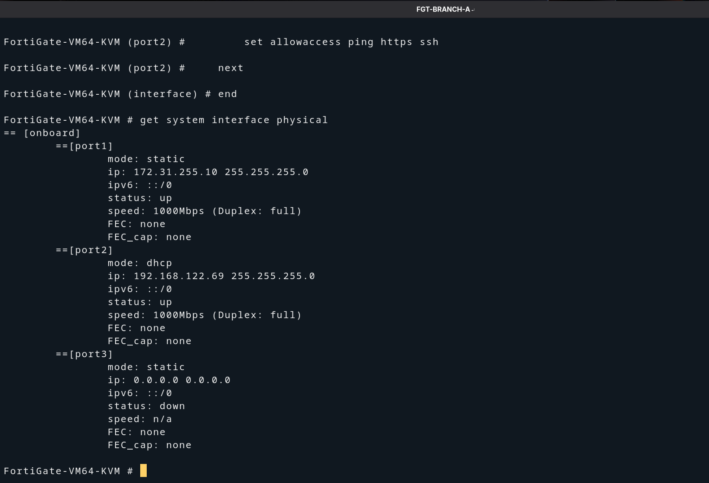
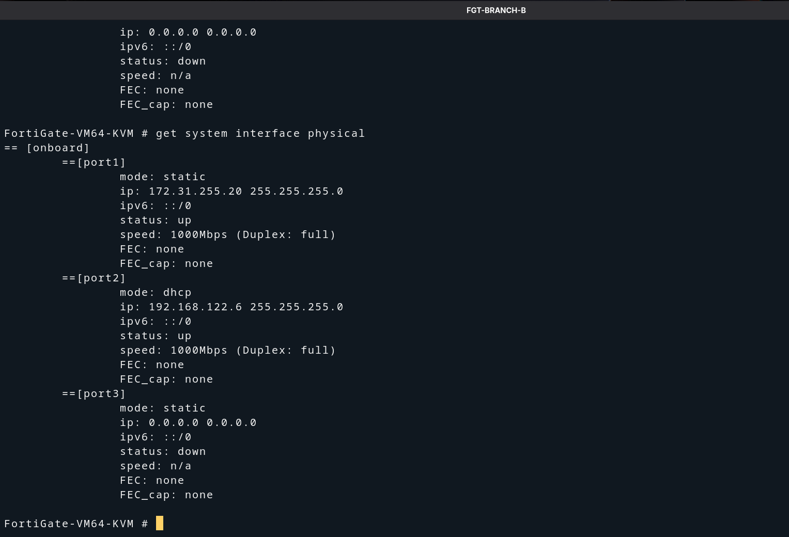
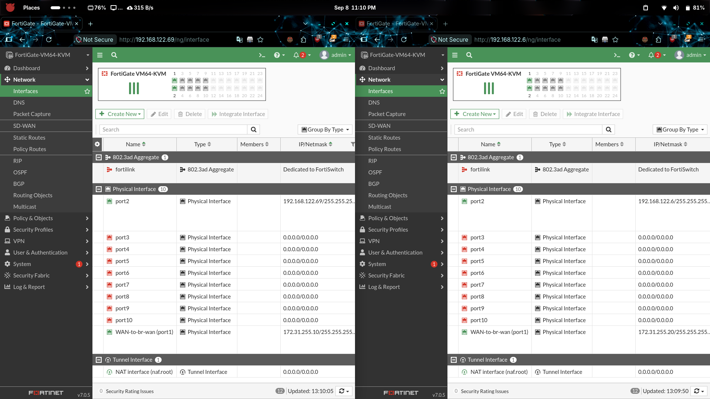

# Management Interface — NAT & GUI Access (port2)

## Overview

With WAN connectivity working on `port1`, the next step is to enable the
**management interface** (`port2`) on each FortiGate. This interface connects
through GNS3's built-in NAT cloud, which gives each FortiGate:

- A DHCP address on the `192.168.122.0/24` network
- Internet access (via the host's default route)
- Access to the FortiGate web GUI from the host browser

---

## How the NAT Interface Works in GNS3

GNS3 includes a built-in **NAT node** (distinct from the Cloud node used for
`br-wan`). When a FortiGate `port2` is connected to this NAT node, GNS3 acts
as a DHCP server handing out `192.168.122.x` addresses and masquerades traffic
through the host's internet connection.

```
  ┌──────────────────────────────────────────┐
  │            GNS3 NAT Node                 │
  │          (192.168.122.0/24)              │
  └──────────┬───────────────┬───────────────┘
             │ port2          │ port2
             │ DHCP           │ DHCP
    ┌─────────┴────┐   ┌──────┴──────────┐
    │ FGT-BRANCH-A │   │  FGT-BRANCH-B   │
    │ 192.168.122.69│   │ 192.168.122.6   │
    └──────────────┘   └─────────────────┘
```

---

## Management Interface Addresses

| Device       | Interface | Mode | IP Address       | Access URL               |
|--------------|-----------|------|------------------|--------------------------|
| FGT-BRANCH-A | port2     | DHCP | 192.168.122.69   | `http://192.168.122.69`  |
| FGT-BRANCH-B | port2     | DHCP | 192.168.122.6    | `http://192.168.122.6`   |

---

## Step 1 — Connect port2 to the GNS3 NAT Node

1. In GNS3, drag a **NAT** node onto the canvas (found under **End devices**).
2. Connect `FGT-BRANCH-A` **port2** → **NAT node**.
3. Connect `FGT-BRANCH-B` **port2** → **NAT node** (same node is fine —
   the built-in NAT handles multiple clients).

---

## Step 2 — Configure port2 on FGT-BRANCH-A

In the FGT-BRANCH-A console:

```
config system interface
    edit "port2"
        set mode dhcp
        set allowaccess ping http https ssh
    next
end
```

> **Important — HTTP access is required for the GUI.**
> The first attempt used only `ping https ssh`. The GUI opened on
> `http://` (plain HTTP) but the browser was blocked because `http`
> was not in `allowaccess`. Adding `http` to the list resolved it.
> Always include **both** `http` and `https` for management access.

Verify the interface received an IP:

```
get system interface physical
```



**What the screenshot confirms:**

| Field | Value |
|-------|-------|
| port1 | `172.31.255.10` — WAN (br-wan) — up |
| port2 | `192.168.122.69` — Management (DHCP) — up |
| port3 | `0.0.0.0` — unused — down |

---

## Step 3 — Configure port2 on FGT-BRANCH-B

In the FGT-BRANCH-B console:

```
config system interface
    edit "port2"
        set mode dhcp
        set allowaccess ping http https ssh
    next
end
```

Verify:

```
get system interface physical
```



**What the screenshot confirms:**

| Field | Value |
|-------|-------|
| port1 | `172.31.255.20` — WAN (br-wan) — up |
| port2 | `192.168.122.6` — Management (DHCP) — up |
| port3 | `0.0.0.0` — unused — down |

---

## Step 4 — Access the FortiGate GUI

Open a browser on the **host machine** and navigate to each FortiGate's
management IP using **HTTP** (port 80):

| FortiGate    | URL                      |
|--------------|--------------------------|
| FGT-BRANCH-A | `http://192.168.122.69`  |
| FGT-BRANCH-B | `http://192.168.122.6`   |

Log in with:
- **Username:** `admin`
- **Password:** *(the password you set on first login)*

The screenshot below shows both FortiGate GUIs open side-by-side in the
browser, each showing the **Network → Interfaces** page with the correct
IPs confirmed:



**What the screenshot confirms:**

- **FGT-BRANCH-A** (left) — GUI at `http://192.168.122.69`
  - `port2`: `192.168.122.69/255.255.255.0`
  - `WAN-to-br-wan (port1)`: `172.31.255.10/255.255.255.0`

- **FGT-BRANCH-B** (right) — GUI at `http://192.168.122.6`
  - `port2`: `192.168.122.6/255.255.255.0`
  - `WAN-to-br-wan (port1)`: `172.31.255.20/255.255.255.0`

---

## Troubleshooting — GUI Not Loading

### Problem
After setting `allowaccess ping https ssh`, the browser could not reach
the GUI over `http://`. The page timed out or refused to connect.

### Root Cause
FortiGate's default GUI redirect sends the browser to `http://` first.
With only `https` in `allowaccess`, plain HTTP (port 80) connections were
blocked by the FortiGate itself before the redirect could happen.

### Fix
Add `http` to `allowaccess` on the management interface:

```
config system interface
    edit "port2"
        set allowaccess ping http https ssh
    next
end
```

The browser can now reach `http://192.168.122.x` and the FortiGate will
redirect to HTTPS if desired.

---

## ✅ Milestone — GUI Access Confirmed

| Check | Result |
|-------|--------|
| FGT-BRANCH-A port2 DHCP IP | `192.168.122.69` ✅ |
| FGT-BRANCH-B port2 DHCP IP | `192.168.122.6` ✅ |
| FGT-A GUI reachable | `http://192.168.122.69` ✅ |
| FGT-B GUI reachable | `http://192.168.122.6` ✅ |
| Both GUIs show correct interface IPs | ✅ |

---

## Next Step

With full CLI and GUI access to both FortiGates, the environment is ready
for IPsec VPN configuration.

→ *(Coming soon: `03-ipsec-vpn/00-vpn-overview.md`)*
