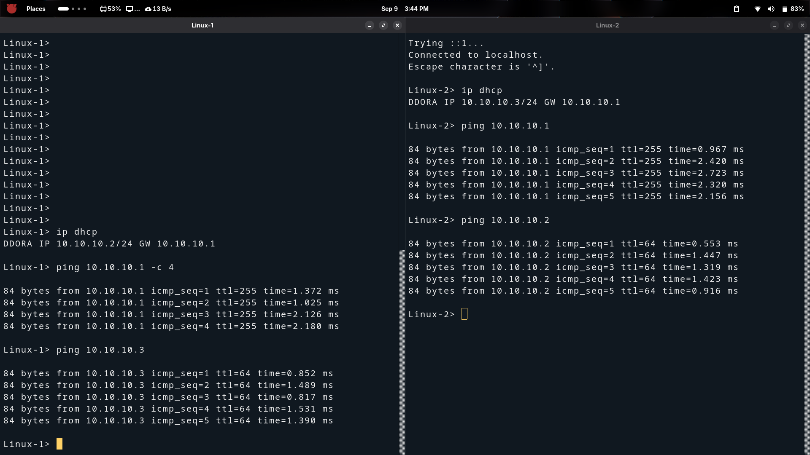
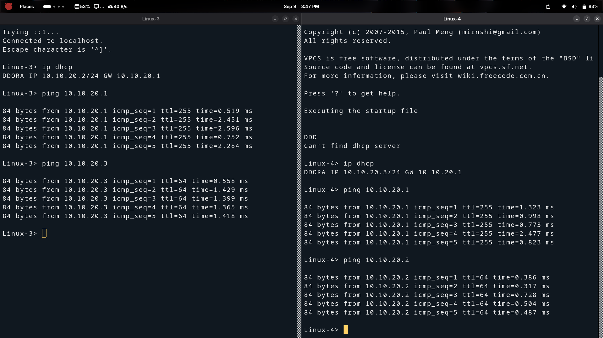
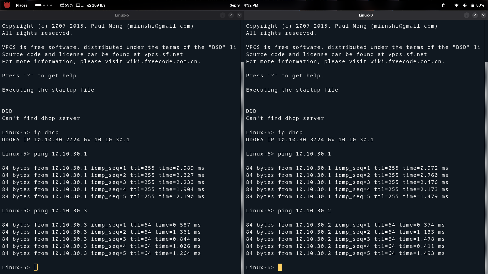
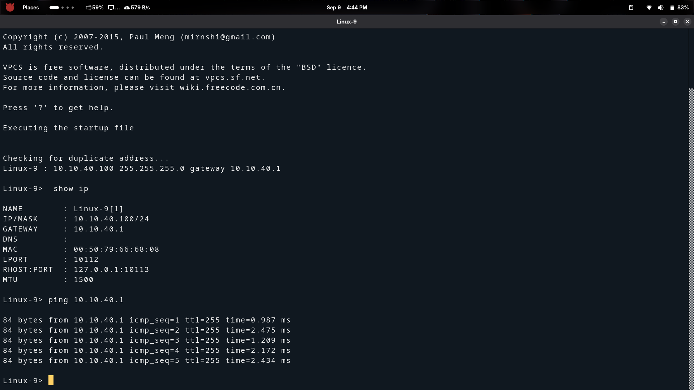
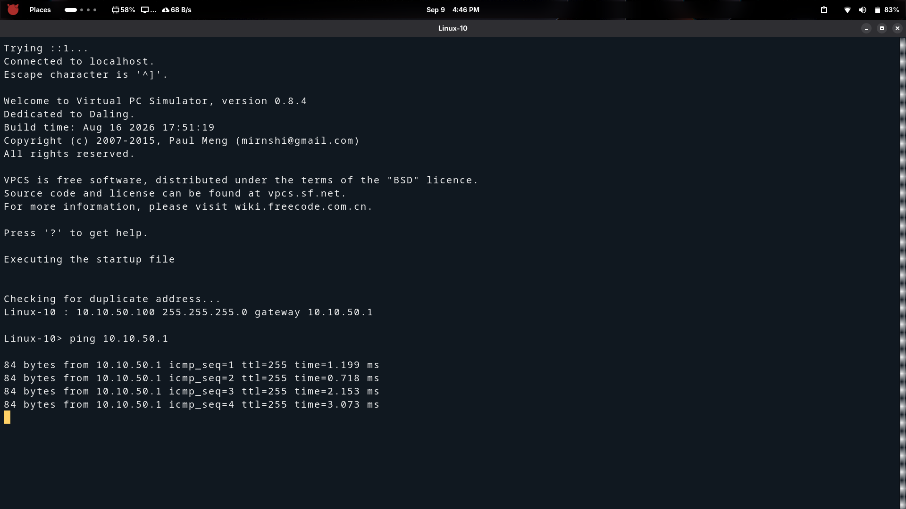
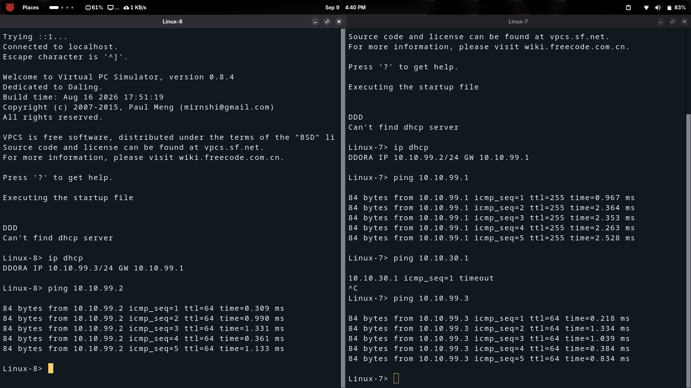

# Branch-A — Linux / Alpine Host Configuration

## Overview

This document covers how each **Alpine Linux** host in **Branch-A (BR1)** receives
its IP address and verifies basic connectivity.

- **DHCP hosts** (HR, IT, Finance, Management VLANs) run `udhcpc` to get an IP
  automatically from FGT-BRANCH-A.
- **Static hosts** (Server_1 VLAN40, Server_2 VLAN50) are configured manually
  with a fixed IP and default gateway.

---

## Host → VLAN Reference

| Host        | VLAN | Method | Expected IP Range     | Gateway      |
|-------------|------|--------|-----------------------|--------------|
| Linux-1     | 10   | DHCP   | 10.10.10.100–200/24   | 10.10.10.1   |
| Linux-2     | 10   | DHCP   | 10.10.10.100–200/24   | 10.10.10.1   |
| Linux-3     | 20   | DHCP   | 10.10.20.100–200/24   | 10.10.20.1   |
| Linux-4     | 20   | DHCP   | 10.10.20.100–200/24   | 10.10.20.1   |
| Linux-5     | 30   | DHCP   | 10.10.30.100–200/24   | 10.10.30.1   |
| Linux-6     | 30   | DHCP   | 10.10.30.100–200/24   | 10.10.30.1   |
| Linux-7     | 99   | DHCP   | 10.10.99.100–200/24   | 10.10.99.1   |
| Linux-8     | 99   | DHCP   | 10.10.99.100–200/24   | 10.10.99.1   |
| Linux-9     | 40   | Static | 10.10.40.10/24        | 10.10.40.1   |
| Linux-10    | 50   | Static | 10.10.50.10/24        | 10.10.50.1   |

---

## DHCP Hosts — Alpine Linux

Open the host console in GNS3 and run:

```sh
# Request IP via DHCP (Alpine uses busybox udhcpc)
udhcpc -i eth0

# Verify IP assignment
ip addr show eth0

# Verify default route
ip route show

# Test gateway reachability (replace with correct gateway for VLAN)
ping -c 4 10.10.10.1     # VLAN10 HR example
```

Expected output from `ip addr show eth0`:
```
2: eth0: <BROADCAST,MULTICAST,UP,LOWER_UP> ...
    inet 10.10.10.1xx/24 brd 10.10.10.255 scope global eth0
```

---

## Static Hosts — Alpine Linux (Server VLANs)

### Server_1 — VLAN 40 (10.10.40.10/24)

```sh
# Set static IP
ip addr add 10.10.40.10/24 dev eth0
ip link set eth0 up

# Set default gateway
ip route add default via 10.10.40.1

# Verify
ip addr show eth0
ip route show

# Test gateway
ping -c 4 10.10.40.1
```

### Server_2 — VLAN 50 (10.10.50.10/24)

```sh
ip addr add 10.10.50.10/24 dev eth0
ip link set eth0 up
ip route add default via 10.10.50.1

# Verify
ip addr show eth0
ip route show
ping -c 4 10.10.50.1
```

---

## Persistent Static IP (Alpine — `/etc/network/interfaces`)

To make the static IP survive a reboot on Alpine:

```sh
cat > /etc/network/interfaces << 'EOF'
auto lo
iface lo inet loopback

auto eth0
iface eth0 inet static
    address 10.10.40.10
    netmask 255.255.255.0
    gateway 10.10.40.1
EOF

# Bring up the interface
ifup eth0
```

---

## Intra-VLAN Ping Test

After all hosts have IPs, verify each VLAN's hosts can reach each other:

```sh
# VLAN 10 — HR: Linux-1 pings Linux-2
ping -c 4 <Linux-2-IP>

# VLAN 20 — IT: Linux-3 pings Linux-4
ping -c 4 <Linux-4-IP>

# VLAN 30 — Finance: Linux-5 pings Linux-6
ping -c 4 <Linux-6-IP>
```

---

## Screenshots

### VLAN 10 — HR



---

### VLAN 20 — IT



---

### VLAN 30 — Finance



---

### VLAN 40 — Server 1



---

### VLAN 50 — Server 2



---

### VLAN 99 — Management



---

## Milestone Checklist

| Check                                      | Expected                             |
|--------------------------------------------|--------------------------------------|
| Linux-1 DHCP lease in VLAN10              | 10.10.10.100–200/24                  |
| Linux-2 DHCP lease in VLAN10              | 10.10.10.100–200/24                  |
| Linux-3 DHCP lease in VLAN20              | 10.10.20.100–200/24                  |
| Linux-4 DHCP lease in VLAN20              | 10.10.20.100–200/24                  |
| Linux-5 DHCP lease in VLAN30              | 10.10.30.100–200/24                  |
| Linux-6 DHCP lease in VLAN30              | 10.10.30.100–200/24                  |
| Linux-7 DHCP lease in VLAN99              | 10.10.99.100–200/24                  |
| Linux-8 DHCP lease in VLAN99              | 10.10.99.100–200/24                  |
| Linux-9 static IP — Server_1 VLAN40       | 10.10.40.10/24                       |
| Linux-10 static IP — Server_2 VLAN50      | 10.10.50.10/24                       |
| Each host pings its VLAN gateway          | 0% packet loss                       |
| Intra-VLAN hosts ping each other          | 0% packet loss                       |

---

## Next Step

Once all hosts are verified, proceed to build the IPsec VPN tunnel.

→ *See: `docs/02-topology-setup/IPSEC-VPN/01-ipsec-phase1-config.md`*
