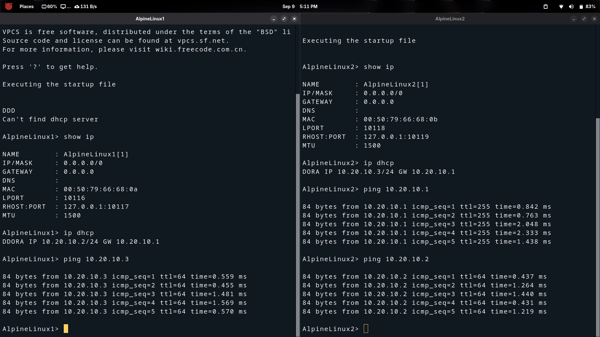
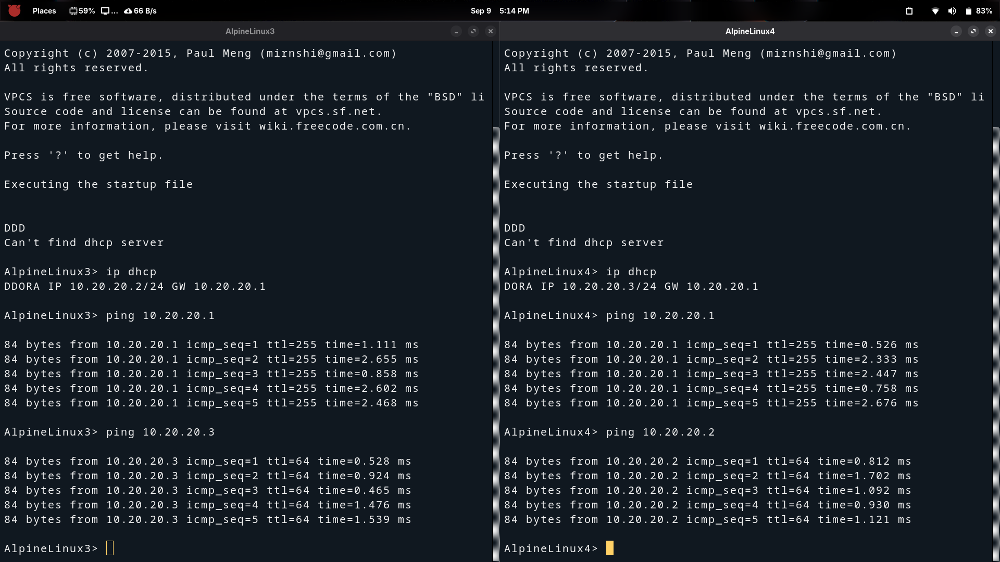
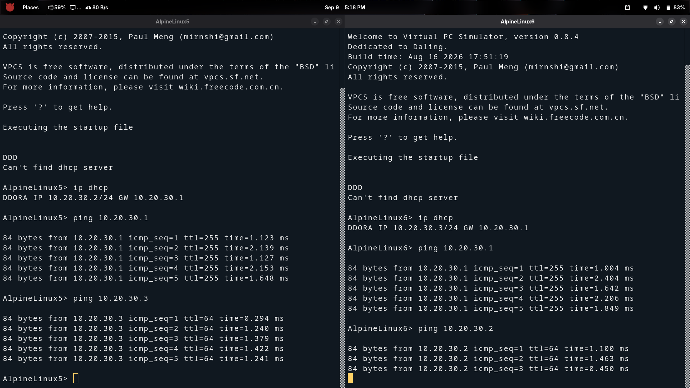
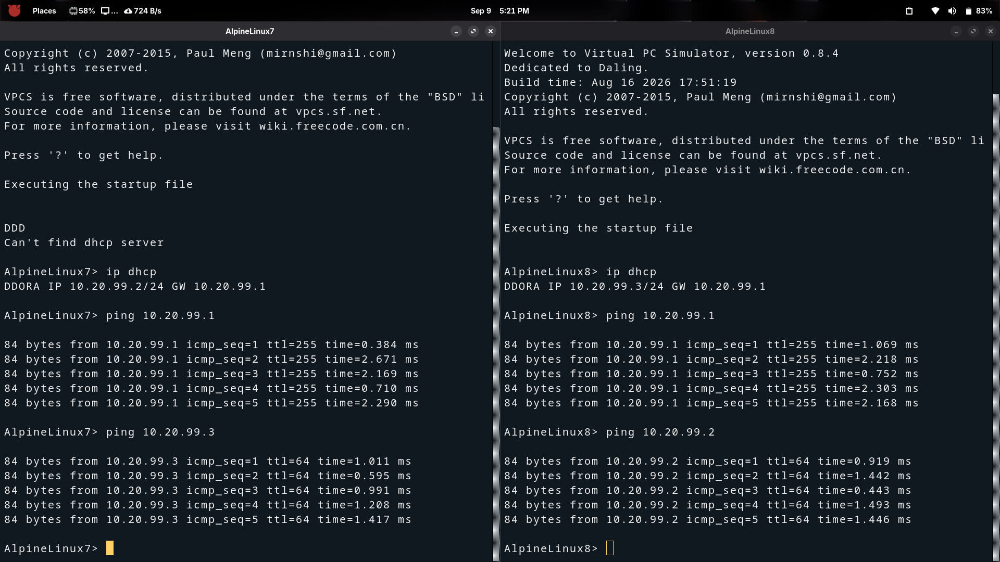

# Branch-B — Linux / Alpine Host Configuration

## Overview

This document covers how each **Alpine Linux** host in **Branch-B (BR2)** receives
its IP address and verifies basic connectivity.

All four VLANs in Branch-B (Sales, Support, Guest, Management) use **DHCP**.
Hosts run `udhcpc` to obtain an IP automatically from **FGT-BRANCH-B**.

---

## Host → VLAN Reference

| Host          | VLAN | Method | Expected IP Range      | Gateway      |
|---------------|------|--------|------------------------|--------------|
| AlpineLinux1  | 110  | DHCP   | 10.20.10.100–200/24    | 10.20.10.1   |
| AlpineLinux2  | 110  | DHCP   | 10.20.10.100–200/24    | 10.20.10.1   |
| AlpineLinux3  | 120  | DHCP   | 10.20.20.100–200/24    | 10.20.20.1   |
| AlpineLinux4  | 120  | DHCP   | 10.20.20.100–200/24    | 10.20.20.1   |
| AlpineLinux5  | 130  | DHCP   | 10.20.30.100–200/24    | 10.20.30.1   |
| AlpineLinux6  | 130  | DHCP   | 10.20.30.100–200/24    | 10.20.30.1   |
| AlpineLinux7  | 199  | DHCP   | 10.20.99.100–200/24    | 10.20.99.1   |
| AlpineLinux8  | 199  | DHCP   | 10.20.99.100–200/24    | 10.20.99.1   |

---

## DHCP Host Setup — Alpine Linux

Open each host console in GNS3 and run:

```sh
# Request IP via DHCP (Alpine uses busybox udhcpc)
udhcpc -i eth0

# Verify IP assignment
ip addr show eth0

# Verify default route
ip route show

# Test gateway reachability (use gateway for this host's VLAN)
ping -c 4 10.20.10.1     # VLAN110 Sales example
```

### Per-VLAN Gateway Ping Reference

| VLAN | Name    | Gateway Ping Command      |
|------|---------|---------------------------|
| 110  | Sales   | `ping -c 4 10.20.10.1`   |
| 120  | Support | `ping -c 4 10.20.20.1`   |
| 130  | Guest   | `ping -c 4 10.20.30.1`   |
| 199  | Mgmt    | `ping -c 4 10.20.99.1`   |

---

## Intra-VLAN Ping Test

After all hosts have IPs, verify each VLAN's hosts can reach each other:

```sh
# VLAN 110 — Sales: AlpineLinux1 pings AlpineLinux2
ping -c 4 <AlpineLinux2-IP>

# VLAN 120 — Support: AlpineLinux3 pings AlpineLinux4
ping -c 4 <AlpineLinux4-IP>

# VLAN 130 — Guest: AlpineLinux5 pings AlpineLinux6
ping -c 4 <AlpineLinux6-IP>
```

---

## Screenshots

### VLAN 110 — Sales



---

### VLAN 120 — Support



---

### VLAN 130 — Guest



---

### VLAN 199 — Management



---

## Milestone Checklist

| Check                                          | Expected                           |
|------------------------------------------------|------------------------------------|
| AlpineLinux1 DHCP lease in VLAN110            | 10.20.10.100–200/24                |
| AlpineLinux2 DHCP lease in VLAN110            | 10.20.10.100–200/24                |
| AlpineLinux3 DHCP lease in VLAN120            | 10.20.20.100–200/24                |
| AlpineLinux4 DHCP lease in VLAN120            | 10.20.20.100–200/24                |
| AlpineLinux5 DHCP lease in VLAN130            | 10.20.30.100–200/24                |
| AlpineLinux6 DHCP lease in VLAN130            | 10.20.30.100–200/24                |
| AlpineLinux7 DHCP lease in VLAN199            | 10.20.99.100–200/24                |
| AlpineLinux8 DHCP lease in VLAN199            | 10.20.99.100–200/24                |
| Each host pings its VLAN gateway              | 0% packet loss                     |
| Intra-VLAN hosts ping each other              | 0% packet loss                     |

---

## Next Step

Once all Branch-B hosts are verified, proceed to build the IPsec VPN tunnel.

→ *See: `docs/02-topology-setup/IPSEC-VPN/01-ipsec-phase1-config.md`*
