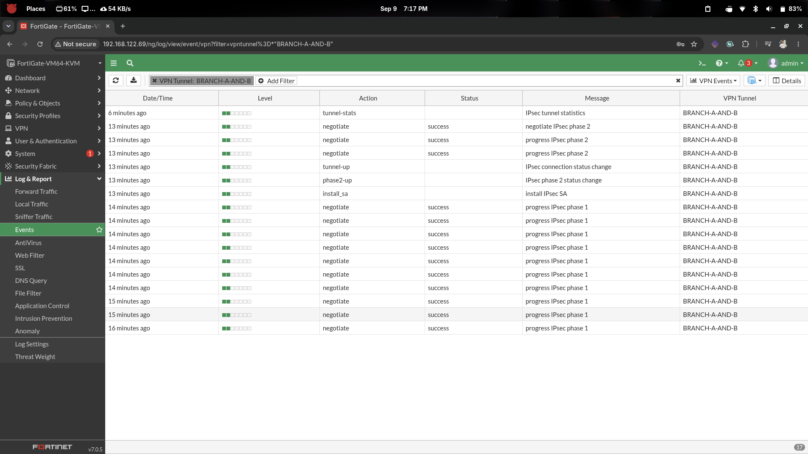
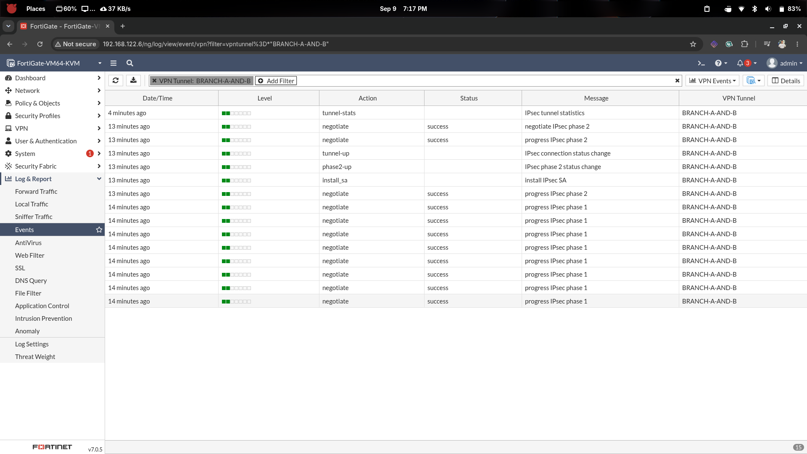
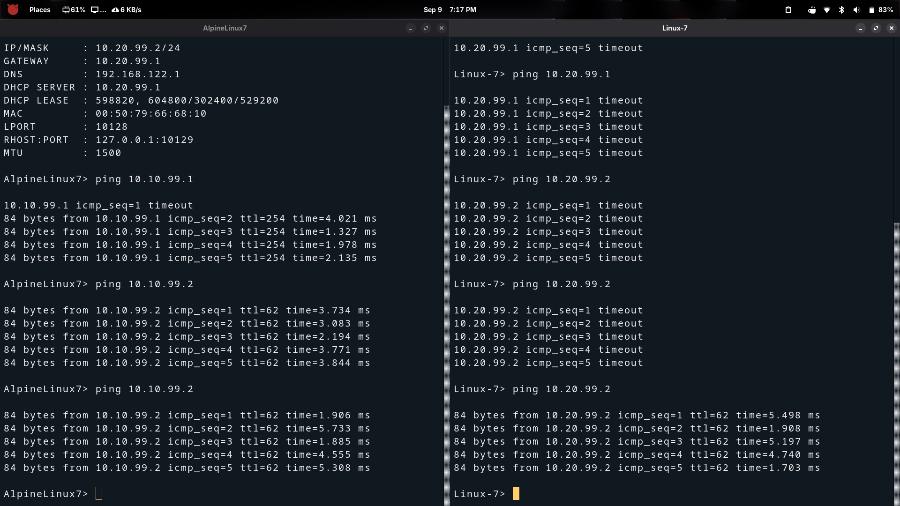

# IPsec VPN — Cross-Site Management Access (Proof of Concept)

## Overview

This document records the **final proof-of-concept** for the
FortiGate Secure Site-to-Site Lab.

The IPsec tunnel between **FGT-BRANCH-A** and **FGT-BRANCH-B** was successfully
established, and controlled cross-site access was demonstrated between:

| Source                            | Destination                        | Result |
|-----------------------------------|------------------------------------|--------|
| Branch-B Management (VLAN 199)    | Branch-A Management (VLAN 99)      | ✅ PASS |
| Branch-A Management (VLAN 99)     | Branch-B Management (VLAN 199)     | ✅ PASS |

Traffic flows encrypted through the IPsec tunnel and is controlled by
explicit firewall policies on both FortiGates.

---

## What Was Implemented

### 1. IPsec Tunnel (Phase 1 & Phase 2)

The tunnel was built on top of the WAN segment (`172.31.255.0/24`).

```
FGT-BRANCH-A                              FGT-BRANCH-B
  port1: 172.31.255.10  ◄─── IPsec ───►  port1: 172.31.255.20
```

- Phase 1 tunnel name on A: `BRANCH-A-AND-B`
- Phase 1 tunnel name on B: `BRANCH-B-AND-A`
- Authentication: Pre-Shared Key
- Encryption: AES-256 / SHA-256 / DH Group 14
- Phase 2 selectors: `10.10.0.0/16` ↔ `10.20.0.0/16`

### 2. Static Routes

Both FortiGates have a static route directing cross-site traffic into the tunnel.

**FGT-BRANCH-A:**
```sh
config router static
    edit 10
        set dst 10.20.0.0 255.255.0.0
        set device "BRANCH-A-AND-B"
    next
end
```

**FGT-BRANCH-B:**
```sh
config router static
    edit 10
        set dst 10.10.0.0 255.255.0.0
        set device "BRANCH-B-AND-A"
    next
end
```

### 3. Cross-Site Address Objects

New address objects were created on each FortiGate to reference the
remote management network.

**FGT-BRANCH-A:**
```sh
config firewall address
    edit "B-MANAGEMENT"
        set subnet 10.20.99.0 255.255.255.0
        set comment "Branch-B VLAN199 Management (remote)"
    next
end
```

**FGT-BRANCH-B:**
```sh
config firewall address
    edit "A-MANAGEMENT"
        set subnet 10.10.99.0 255.255.255.0
        set comment "Branch-A VLAN99 Management (remote)"
    next
end
```

### 4. VPN Firewall Policies

Policies are required **in both directions** on each FortiGate.
Four policies total — two per FortiGate.

#### FGT-BRANCH-A

**Policy — MGMT outbound to tunnel (A→B):**
```sh
config firewall policy
    edit 0
        set name "A-MGMT-TO-BRB-MGMT"
        set srcintf "BRA-MGMT"
        set dstintf "BRANCH-A-AND-B"
        set srcaddr "A-MANAGEMENT"
        set dstaddr "B-MANAGEMENT"
        set action accept
        set schedule "always"
        set service "ALL"
        set nat disable
        set logtraffic all
    next
end
```

**Policy — tunnel inbound to MGMT (B→A):**
```sh
config firewall policy
    edit 0
        set name "BRB-MGMT-TO-A-MGMT"
        set srcintf "BRANCH-A-AND-B"
        set dstintf "BRA-MGMT"
        set srcaddr "B-MANAGEMENT"
        set dstaddr "A-MANAGEMENT"
        set action accept
        set schedule "always"
        set service "ALL"
        set nat disable
        set logtraffic all
    next
end
```

#### FGT-BRANCH-B

**Policy — MGMT outbound to tunnel (B→A):**
```sh
config firewall policy
    edit 0
        set name "B-MGMT-TO-BRA-MGMT"
        set srcintf "BRB-MGMT"
        set dstintf "BRANCH-B-AND-A"
        set srcaddr "B-MANAGEMENT"
        set dstaddr "A-MANAGEMENT"
        set action accept
        set schedule "always"
        set service "ALL"
        set nat disable
        set logtraffic all
    next
end
```

**Policy — tunnel inbound to MGMT (A→B):**
```sh
config firewall policy
    edit 0
        set name "BRA-MGMT-TO-B-MGMT"
        set srcintf "BRANCH-B-AND-A"
        set dstintf "BRB-MGMT"
        set srcaddr "A-MANAGEMENT"
        set dstaddr "B-MANAGEMENT"
        set action accept
        set schedule "always"
        set service "ALL"
        set nat disable
        set logtraffic all
    next
end
```

> ✅ **NAT is OFF** on all VPN policies — original source addresses
> must be preserved across the tunnel.

---

## Proof-of-Concept Ping Test

### Test Setup

| Host          | Branch | VLAN | IP Address   |
|---------------|--------|------|--------------|
| AlpineLinux7  | B      | 199  | 10.20.99.2   |
| Linux-7       | A      | 99   | 10.10.99.x   |

### From AlpineLinux7 (Branch-B Management) → Branch-A Management

```sh
# Ping Branch-A VLAN99 gateway (FortiGate interface)
ping 10.10.99.1

# Ping Linux-7 (Branch-A management host)
ping 10.10.99.2
```

**Result:**
```
84 bytes from 10.10.99.1  ttl=254  time=4.021 ms
84 bytes from 10.10.99.1  ttl=254  time=1.327 ms
84 bytes from 10.10.99.1  ttl=254  time=1.978 ms
84 bytes from 10.10.99.1  ttl=254  time=2.135 ms

84 bytes from 10.10.99.2  ttl=62   time=3.734 ms
84 bytes from 10.10.99.2  ttl=62   time=3.083 ms
84 bytes from 10.10.99.2  ttl=62   time=2.194 ms
84 bytes from 10.10.99.2  ttl=62   time=3.771 ms
```

✅ **0% packet loss — cross-site management access confirmed.**

### From Linux-7 (Branch-A Management) → Branch-B Management

```sh
# Ping Branch-B VLAN199 management host
ping 10.20.99.2
```

**Result:**
```
84 bytes from 10.20.99.2  ttl=62   time=5.498 ms
84 bytes from 10.20.99.2  ttl=62   time=1.908 ms
84 bytes from 10.20.99.2  ttl=62   time=5.197 ms
84 bytes from 10.20.99.2  ttl=62   time=4.740 ms
84 bytes from 10.20.99.2  ttl=62   time=1.703 ms
```

✅ **0% packet loss — bidirectional tunnel confirmed.**

> **Note on TTL values:**
> - TTL 254 = traffic reached the FortiGate interface (1 hop from Linux host)
> - TTL 62 = traffic traversed the full IPsec tunnel to a remote host (multiple hops)

---

## Screenshots

### FortiGate VPN Event Log — Phase 1 & Phase 2 Negotiation





The VPN event logs show for tunnel **`BRANCH-A-AND-B`**:

| Time       | Action      | Status  | Message                        |
|------------|-------------|---------|--------------------------------|
| 16 min ago | negotiate   | success | progress IPsec phase 1         |
| 15 min ago | negotiate   | success | progress IPsec phase 1         |
| 14 min ago | negotiate   | success | progress IPsec phase 1 (×6)    |
| 13 min ago | negotiate   | success | negotiate IPsec phase 2        |
| 13 min ago | negotiate   | success | progress IPsec phase 2         |
| 13 min ago | tunnel-up   |         | IPsec connection status change |
| 13 min ago | phase2-up   |         | IPsec phase 2 status change    |
| 13 min ago | install_sa  |         | Install IPsec SA               |
| 6 min ago  | tunnel-stats|         | IPsec tunnel statistics        |

### Cross-Site Management Ping Proof



The screenshot shows:
- **Left pane (AlpineLinux7 — 10.20.99.2):**
  - First ping to `10.10.99.1` — 1 timeout, then 4× success (TTL=254, ~1–4 ms)
  - Ping to `10.10.99.2` (Linux-7) — 5× success (TTL=62, ~2–5 ms)
  - Third ping to `10.10.99.2` — 5× success (TTL=62, ~1–5 ms)
- **Right pane (Linux-7 — Branch-A MGMT):**
  - First two attempts to `10.20.99.1` — timeout (tunnel initialising)
  - Second attempt to `10.20.99.2` — 5× timeout
  - Third attempt to `10.20.99.2` — 5× success (TTL=62, ~1–5 ms)


---

## Tunnel Verification Commands

```sh
# Check Phase 1 status
diagnose vpn ike gateway list

# Check Phase 2 / active SAs
diagnose vpn tunnel list
get vpn ipsec tunnel summary

# Check routing table (should show 10.20.0.0/16 via tunnel interface)
get router info routing-table all

# Check active sessions crossing the tunnel
diagnose sys session list
```

Expected Phase 2 output:
```
name=SITE-A-TO-B ...
version=1 ...
  rgwy=172.31.255.20 ...
  APcnt=0 APbcnt=0 ...
  in bound SPI: ...
  out bound SPI: ...
```

---

## Security Design Summary

The tunnel is **not a flat any-to-any connection**. Only explicitly allowed
VLAN pairs are permitted through the tunnel firewall policies.

| Cross-Site Flow                                  | Status       |
|--------------------------------------------------|--------------|
| Branch-A MGMT (99) → Branch-B MGMT (199)        | ✅ Allowed    |
| Branch-B MGMT (199) → Branch-A MGMT (99)        | ✅ Allowed    |
| Branch-A HR (10) → Branch-B Sales (110)          | ❌ Blocked    |
| Branch-B Guest (130) → Branch-A (any)            | ❌ Blocked    |
| Branch-A Finance (30) → Branch-B (any)           | ❌ Blocked    |

This demonstrates that the VPN enforces **controlled, per-VLAN access**
rather than opening unrestricted site-to-site connectivity.

---

## Milestone Checklist

| Check                                              | Expected              |
|----------------------------------------------------|-----------------------|
| Phase 1 SITE-A-TO-B established                    | ✅ Status: up          |
| Phase 1 SITE-B-TO-A established                    | ✅ Status: up          |
| Phase 2 selectors 10.10.0.0/16 ↔ 10.20.0.0/16     | ✅ SA active           |
| Static route 10.20.0.0/16 on FGT-A                | ✅ via SITE-A-TO-B     |
| Static route 10.10.0.0/16 on FGT-B                | ✅ via SITE-B-TO-A     |
| VPN policies for MGMT↔MGMT on FGT-A               | ✅ 2 policies          |
| VPN policies for MGMT↔MGMT on FGT-B               | ✅ 2 policies          |
| AlpineLinux7 → 10.10.99.1 (FGT-A MGMT gateway)    | ✅ 0% packet loss      |
| AlpineLinux7 → 10.10.99.2 (Linux-7)               | ✅ 0% packet loss      |
| Linux-7 → 10.20.99.2 (AlpineLinux7)               | ✅ 0% packet loss      |
| Cross-site denied traffic (HR → Sales)             | ✅ Implicitly denied   |

---

## Project Complete

**All lab objectives have been achieved:**

1. ✅ GNS3 topology with two FortiGate branches deployed
2. ✅ WAN connectivity between branches over shared segment
3. ✅ VLAN segmentation (6 VLANs on Branch-A, 4 VLANs on Branch-B)
4. ✅ Layer-3 switching via FortiGate VLAN subinterfaces
5. ✅ DHCP per VLAN on both branches
6. ✅ Linux/Alpine hosts fully configured with correct IPs
7. ✅ Firewall address objects and groups on both branches
8. ✅ Branch-A internal policies (least privilege, 8 policies)
9. ✅ Branch-B isolation policies + Internet/NAT
10. ✅ IPsec Site-to-Site VPN established (IKEv1, AES-256, SHA-256)
11. ✅ Controlled cross-site access: Management VLAN ↔ Management VLAN
12. ✅ Non-permitted cross-site flows remain blocked

→ *This is the final document in the lab series.*
