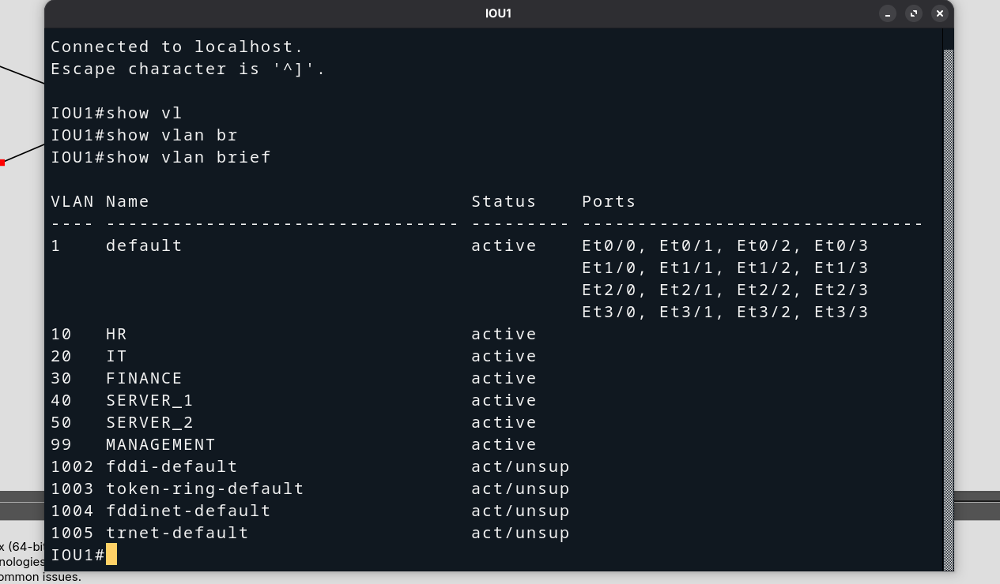
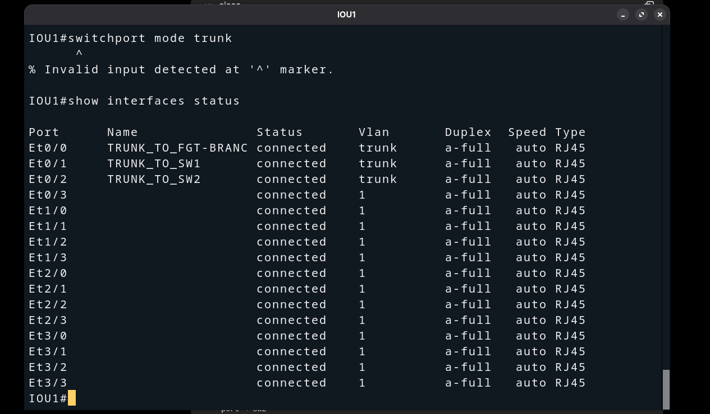

# IOU1 — VLAN Creation & Trunk Configuration (BR1)

## Overview

**IOU1** is the central distribution switch for **Branch-A (BR1)**.  
It sits between `FGT-BRANCH-A port3` and the two access switches **SW1** and **SW2**,
carrying all six VLANs across three trunk links.

---

## Topology

```
        FGT-BRANCH-A
              |
         port3 TRUNK
              |
           [ IOU1 ]
           /       \
     TRUNK           TRUNK
       /               \
    [ SW1 ]          [ SW2 ]
   /  |  |  \         /    \
V10  V20 V30 V99    V40    V50
HR   IT  Fin  Mgmt  SRV1   SRV2
```

### Interface Mapping

| Interface    | Connected To       | Role              |
|--------------|--------------------|-------------------|
| Ethernet0/0  | FGT-BRANCH-A port3 | Uplink trunk      |
| Ethernet0/1  | SW1                | Downlink trunk    |
| Ethernet0/2  | SW2                | Downlink trunk    |

---

## Step 1 — Create VLANs

```
enable
configure terminal

vlan 10
 name HR
exit

vlan 20
 name IT
exit

vlan 30
 name FINANCE
exit

vlan 40
 name SERVER_1
exit

vlan 50
 name SERVER_2
exit

vlan 99
 name MANAGEMENT
exit

end
write memory
```

Verify:

```
show vlan brief
```



---

## Step 2 — Configure Trunk Interfaces

```
configure terminal

interface Ethernet0/0
 description TRUNK_TO_FGT-BRANCH-A
 switchport trunk encapsulation dot1q
 switchport mode trunk
 switchport trunk allowed vlan 10,20,30,40,50,99
 no shutdown
exit

interface Ethernet0/1
 description TRUNK_TO_SW1
 switchport trunk encapsulation dot1q
 switchport mode trunk
 switchport trunk allowed vlan 10,20,30,40,50,99
 no shutdown
exit

interface Ethernet0/2
 description TRUNK_TO_SW2
 switchport trunk encapsulation dot1q
 switchport mode trunk
 switchport trunk allowed vlan 10,20,30,40,50,99
 no shutdown
exit

end
write memory
```

> **Note:** `switchport trunk encapsulation dot1q` is required on IOU (Cisco
> IOS) switches before setting the mode to trunk. This explicitly selects
> 802.1Q encapsulation over ISL.

Verify:

```
show interfaces status
show interfaces trunk
show cdp neighbors
```



---

## Milestone Checklist — IOU1

| Check                              | Expected                          |
|------------------------------------|-----------------------------------|
| VLAN 10 HR in database             | Active                            |
| VLAN 20 IT in database             | Active                            |
| VLAN 30 FINANCE in database        | Active                            |
| VLAN 40 SERVER_1 in database       | Active                            |
| VLAN 50 SERVER_2 in database       | Active                            |
| VLAN 99 MANAGEMENT in database     | Active                            |
| Ethernet0/0 mode                   | trunk — to FGT-BRANCH-A           |
| Ethernet0/1 mode                   | trunk — to SW1                    |
| Ethernet0/2 mode                   | trunk — to SW2                    |
| Allowed VLANs on all trunks        | 10, 20, 30, 40, 50, 99            |

---

## Next Step

Configure access ports on **SW1** and **SW2** to assign each host port to the
correct VLAN.

→ *See: `docs/02-topology-setup/SWITCHES/BRANCH-A/SW1/` and `SW2/`*
