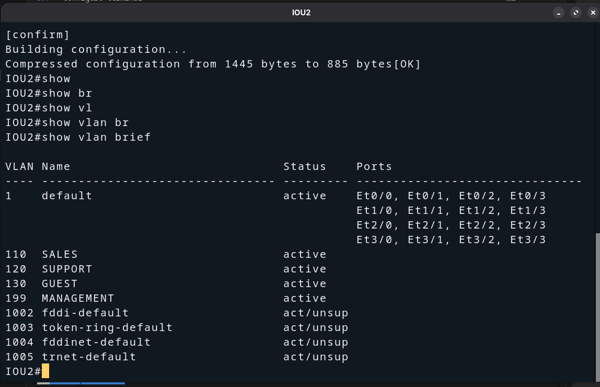
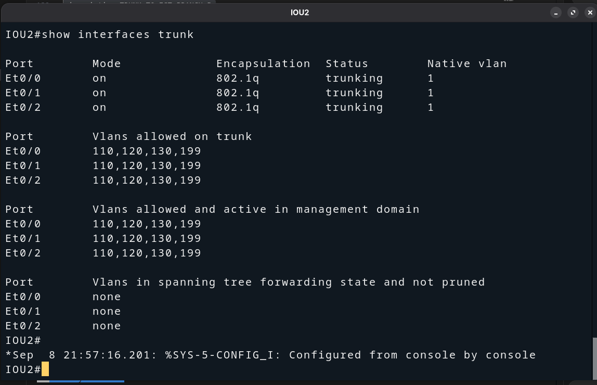

# IOU2 — VLAN Creation & Trunk Configuration (BR2)

## Overview

**IOU2** is the central distribution switch for **Branch-B (BR2)**.  
It sits between `FGT-BRANCH-B port3` and the two access switches **SW3** and **SW4**,
carrying all four VLANs across three trunk links.

---

## Topology

```
        FGT-BRANCH-B
              |
         port3 TRUNK
              |
           [ IOU2 ]
           /       \
     TRUNK           TRUNK
       /               \
    [ SW3 ]          [ SW4 ]
   /  |  \              |
 V110 V120 V130        V199
Sales Supp Guest       Mgmt
```

### Interface Mapping

| Interface    | Connected To       | Role              |
|--------------|--------------------|-------------------|
| Ethernet0/0  | FGT-BRANCH-B port3 | Uplink trunk      |
| Ethernet0/1  | SW3                | Downlink trunk    |
| Ethernet0/2  | SW4                | Downlink trunk    |

---

## Step 1 — Create VLANs

```
enable
configure terminal

vlan 110
 name SALES
exit

vlan 120
 name SUPPORT
exit

vlan 130
 name GUEST
exit

vlan 199
 name MANAGEMENT
exit

end
write memory
```

Verify:

```
show vlan brief
```



---

## Step 2 — Configure Trunk Interfaces

```
configure terminal

interface Ethernet0/0
 description TRUNK_TO_FGT-BRANCH-B
 switchport trunk encapsulation dot1q
 switchport mode trunk
 switchport trunk allowed vlan 110,120,130,199
 no shutdown
exit

interface Ethernet0/1
 description TRUNK_TO_SW3
 switchport trunk encapsulation dot1q
 switchport mode trunk
 switchport trunk allowed vlan 110,120,130,199
 no shutdown
exit

interface Ethernet0/2
 description TRUNK_TO_SW4
 switchport trunk encapsulation dot1q
 switchport mode trunk
 switchport trunk allowed vlan 110,120,130,199
 no shutdown
exit

end
write memory
```

> **Note:** `switchport trunk encapsulation dot1q` is required on IOU (Cisco
> IOS) switches before setting the mode to trunk. This explicitly selects
> 802.1Q encapsulation over ISL.

Verify:

```
show interfaces status
show interfaces trunk
show cdp neighbors
```



---

## Milestone Checklist — IOU2

| Check                              | Expected                          |
|------------------------------------|-----------------------------------|
| VLAN 110 SALES in database         | Active                            |
| VLAN 120 SUPPORT in database       | Active                            |
| VLAN 130 GUEST in database         | Active                            |
| VLAN 199 MANAGEMENT in database    | Active                            |
| Ethernet0/0 mode                   | trunk — to FGT-BRANCH-B           |
| Ethernet0/1 mode                   | trunk — to SW3                    |
| Ethernet0/2 mode                   | trunk — to SW4                    |
| Allowed VLANs on all trunks        | 110, 120, 130, 199                |

---

## Next Step

Configure access ports on **SW3** and **SW4** to assign each host port to the
correct VLAN.

→ *See: `docs/02-topology-setup/SWITCHES/BRANCH-B/SW3/` and `SW4/`*
