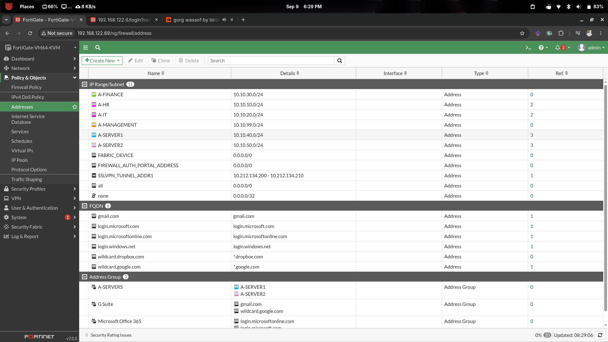

# Branch-A — Firewall Address Objects

## Overview

This document covers all **firewall address objects** and **address groups** created
on **FGT-BRANCH-A**. These objects are used as source/destination references in
firewall policies to avoid repeating raw subnets and keep the policy table clean
and readable.

---

## Address Object Reference

| Object Name    | Subnet           | Description                    |
|----------------|------------------|--------------------------------|
| `A-HR`         | 10.10.10.0/24    | VLAN 10 — HR department        |
| `A-IT`         | 10.10.20.0/24    | VLAN 20 — IT department        |
| `A-FINANCE`    | 10.10.30.0/24    | VLAN 30 — Finance department   |
| `A-SERVER1`    | 10.10.40.0/24    | VLAN 40 — Server 1 network     |
| `A-SERVER2`    | 10.10.50.0/24    | VLAN 50 — Server 2 network     |
| `A-MANAGEMENT` | 10.10.99.0/24    | VLAN 99 — Management network   |

### Address Group

| Group Name  | Members                   | Description         |
|-------------|---------------------------|---------------------|
| `A-SERVERS` | `A-SERVER1`, `A-SERVER2`  | Both server VLANs   |

---

## Configuration — CLI

### Individual Address Objects

```sh
config firewall address

    edit "A-HR"
        set subnet 10.10.10.0 255.255.255.0
        set comment "VLAN10 - HR department"
    next

    edit "A-IT"
        set subnet 10.10.20.0 255.255.255.0
        set comment "VLAN20 - IT department"
    next

    edit "A-FINANCE"
        set subnet 10.10.30.0 255.255.255.0
        set comment "VLAN30 - Finance department"
    next

    edit "A-SERVER1"
        set subnet 10.10.40.0 255.255.255.0
        set comment "VLAN40 - Server 1"
    next

    edit "A-SERVER2"
        set subnet 10.10.50.0 255.255.255.0
        set comment "VLAN50 - Server 2"
    next

    edit "A-MANAGEMENT"
        set subnet 10.10.99.0 255.255.255.0
        set comment "VLAN99 - Management"
    next

end
```

### Address Group

```sh
config firewall addrgrp

    edit "A-SERVERS"
        set member "A-SERVER1" "A-SERVER2"
        set comment "Branch A server networks"
    next

end
```

---

## Verification

```sh
show firewall address
show firewall addrgrp
```

Expected output for `show firewall address`:

```
edit "A-HR"
    set uuid ...
    set subnet 10.10.10.0 255.255.255.0
    set comment "VLAN10 - HR department"
next
edit "A-IT"
    set subnet 10.10.20.0 255.255.255.0
next
edit "A-FINANCE"
    set subnet 10.10.30.0 255.255.255.0
next
edit "A-SERVER1"
    set subnet 10.10.40.0 255.255.255.0
next
edit "A-SERVER2"
    set subnet 10.10.50.0 255.255.255.0
next
edit "A-MANAGEMENT"
    set subnet 10.10.99.0 255.255.255.0
next
```

Expected output for `show firewall addrgrp`:

```
edit "A-SERVERS"
    set member "A-SERVER1" "A-SERVER2"
next
```

---

## Screenshots



---

## Milestone Checklist

| Check                              | Expected                    |
|------------------------------------|-----------------------------|
| `A-HR` address object exists       | 10.10.10.0/255.255.255.0    |
| `A-IT` address object exists       | 10.10.20.0/255.255.255.0    |
| `A-FINANCE` address object exists  | 10.10.30.0/255.255.255.0    |
| `A-SERVER1` address object exists  | 10.10.40.0/255.255.255.0    |
| `A-SERVER2` address object exists  | 10.10.50.0/255.255.255.0    |
| `A-MANAGEMENT` address object exists | 10.10.99.0/255.255.255.0  |
| `A-SERVERS` group contains both servers | A-SERVER1, A-SERVER2   |

---

## Next Step

→ *See: [`01-branch-a-firewall-policies.md`](../POLICIES/01-branch-a-firewall-policies.md)*
