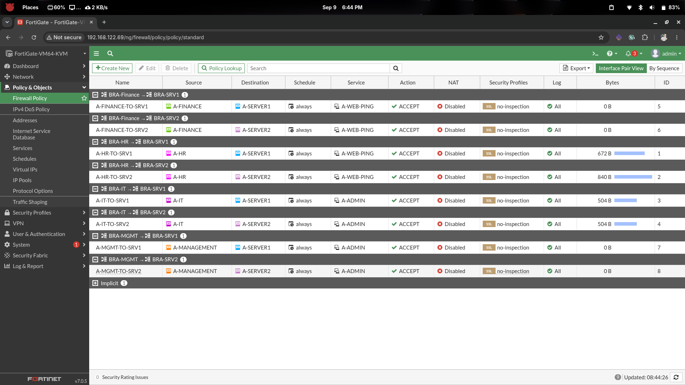

# Branch-A — Firewall Policies

## Overview

This document covers the **internal firewall policies** configured on **FGT-BRANCH-A**
to control traffic between Branch A VLANs.

The design follows the principle of **least privilege**:

- User VLANs (HR, IT, Finance, Management) may only reach the **server VLANs**
- No lateral access is permitted between user VLANs
- NAT is **disabled** on all internal policies (source addresses must be preserved)
- The FortiGate implicit deny handles all unmatched traffic

---

## Design — Allowed Traffic Matrix

| Source VLAN    | Destination     | Service Group   | NAT     |
|----------------|-----------------|-----------------|---------|
| HR (VLAN 10)   | Server 1 (40)   | `A-WEB-PING`    | Off     |
| HR (VLAN 10)   | Server 2 (50)   | `A-WEB-PING`    | Off     |
| IT (VLAN 20)   | Server 1 (40)   | `A-ADMIN`       | Off     |
| IT (VLAN 20)   | Server 2 (50)   | `A-ADMIN`       | Off     |
| Finance (30)   | Server 1 (40)   | `A-WEB-PING`    | Off     |
| Finance (30)   | Server 2 (50)   | `A-WEB-PING`    | Off     |
| Management (99)| Server 1 (40)   | `A-ADMIN`       | Off     |
| Management (99)| Server 2 (50)   | `A-ADMIN`       | Off     |

### Implicitly Denied

The following flows are **blocked by the implicit deny** (no policy created):

```
HR         → IT           DENY
HR         → Finance      DENY
IT         → HR           DENY
IT         → Finance      DENY
Finance    → HR           DENY
Finance    → IT           DENY
Any user   → Management   DENY
```

---

## Service Groups

Reusable service groups were created to avoid repeating the same services
across multiple policies.

| Group Name   | Members               | Who Uses It              |
|--------------|-----------------------|--------------------------|
| `A-WEB-PING` | `HTTPS`, `PING`       | HR, Finance              |
| `A-ADMIN`    | `SSH`, `HTTPS`, `PING`| IT, Management           |

### Configuration

```sh
config firewall service group

    edit "A-WEB-PING"
        set member "HTTPS" "PING"
        set comment "Web access and connectivity testing"
    next

    edit "A-ADMIN"
        set member "SSH" "HTTPS" "PING"
        set comment "Administrative access to servers"
    next

end
```

### Verification

```sh
show firewall service group
```

Expected:

```
edit "A-WEB-PING"
    set member "HTTPS" "PING"
    set comment "Web access and connectivity testing"
next
edit "A-ADMIN"
    set member "SSH" "HTTPS" "PING"
    set comment "Administrative access to servers"
next
```

---

## Policy IDs Reference

After running `show firewall policy`, the confirmed policy IDs are:

| ID | Policy Name        |
|----|--------------------|
| 1  | A-HR-TO-SRV1       |
| 2  | A-HR-TO-SRV2       |
| 3  | A-IT-TO-SRV1       |
| 4  | A-IT-TO-SRV2       |
| 5  | A-FINANCE-TO-SRV1  |
| 6  | A-FINANCE-TO-SRV2  |
| 7  | A-MGMT-TO-SRV1     |
| 8  | A-MGMT-TO-SRV2     |

---

## Policy 1 — HR → Server 1

```sh
config firewall policy
    edit 1
        set name "A-HR-TO-SRV1"
        set srcintf "BRA-HR"
        set dstintf "BRA-SRV1"
        set srcaddr "A-HR"
        set dstaddr "A-SERVER1"
        set action accept
        set schedule "always"
        set service "A-WEB-PING"
        set nat disable
        set utm-status disable
        set logtraffic all
    next
end
```

---

## Policy 2 — HR → Server 2

```sh
config firewall policy
    edit 2
        set name "A-HR-TO-SRV2"
        set srcintf "BRA-HR"
        set dstintf "BRA-SRV2"
        set srcaddr "A-HR"
        set dstaddr "A-SERVER2"
        set action accept
        set schedule "always"
        set service "A-WEB-PING"
        set nat disable
        set utm-status disable
        set logtraffic all
    next
end
```

---

## Policy 3 — IT → Server 1

IT gets `A-ADMIN` which includes SSH in addition to HTTPS and PING.

```sh
config firewall policy
    edit 3
        set name "A-IT-TO-SRV1"
        set srcintf "BRA-IT"
        set dstintf "BRA-SRV1"
        set srcaddr "A-IT"
        set dstaddr "A-SERVER1"
        set action accept
        set schedule "always"
        set service "A-ADMIN"
        set nat disable
        set utm-status disable
        set logtraffic all
    next
end
```

---

## Policy 4 — IT → Server 2

> ⚠️ **Note:** The original configuration of this policy had `NAT: enabled` and
> `UTM: enabled`. Both were corrected — NAT must be **off** for internal
> VLAN-to-VLAN traffic.

```sh
config firewall policy
    edit 4
        set name "A-IT-TO-SRV2"
        set srcintf "BRA-IT"
        set dstintf "BRA-SRV2"
        set srcaddr "A-IT"
        set dstaddr "A-SERVER2"
        set action accept
        set schedule "always"
        set service "A-ADMIN"
        set nat disable
        set utm-status disable
        set logtraffic all
    next
end
```

---

## Policies 5 & 6 — Finance → Server 1 / Server 2

Finance has web and connectivity access only (`A-WEB-PING`).

```sh
config firewall policy

    edit 0
        set name "A-FINANCE-TO-SRV1"
        set srcintf "BRA-FINANCE"
        set dstintf "BRA-SRV1"
        set srcaddr "A-FINANCE"
        set dstaddr "A-SERVER1"
        set action accept
        set schedule "always"
        set service "A-WEB-PING"
        set nat disable
        set utm-status disable
        set logtraffic all
    next

    edit 0
        set name "A-FINANCE-TO-SRV2"
        set srcintf "BRA-FINANCE"
        set dstintf "BRA-SRV2"
        set srcaddr "A-FINANCE"
        set dstaddr "A-SERVER2"
        set action accept
        set schedule "always"
        set service "A-WEB-PING"
        set nat disable
        set utm-status disable
        set logtraffic all
    next

end
```

---

## Policies 7 & 8 — Management → Server 1 / Server 2

Management gets full admin access (`A-ADMIN`): SSH + HTTPS + PING.

```sh
config firewall policy

    edit 0
        set name "A-MGMT-TO-SRV1"
        set srcintf "BRA-MGMT"
        set dstintf "BRA-SRV1"
        set srcaddr "A-MANAGEMENT"
        set dstaddr "A-SERVER1"
        set action accept
        set schedule "always"
        set service "A-ADMIN"
        set nat disable
        set utm-status disable
        set logtraffic all
    next

    edit 0
        set name "A-MGMT-TO-SRV2"
        set srcintf "BRA-MGMT"
        set dstintf "BRA-SRV2"
        set srcaddr "A-MANAGEMENT"
        set dstaddr "A-SERVER2"
        set action accept
        set schedule "always"
        set service "A-ADMIN"
        set nat disable
        set utm-status disable
        set logtraffic all
    next

end
```

---

## Full Verification

```sh
show firewall policy
```

Or per policy:

```sh
show firewall policy 1
show firewall policy 2
show firewall policy 3
show firewall policy 4
```

---

## Screenshots



---

## Milestone Checklist

| Check                                    | Expected                    |
|------------------------------------------|-----------------------------|
| Service group `A-WEB-PING` exists        | HTTPS, PING                 |
| Service group `A-ADMIN` exists           | SSH, HTTPS, PING            |
| Policy 1 — A-HR-TO-SRV1                  | NAT off, UTM off, log all   |
| Policy 2 — A-HR-TO-SRV2                  | NAT off, UTM off, log all   |
| Policy 3 — A-IT-TO-SRV1                  | NAT off, UTM off, log all   |
| Policy 4 — A-IT-TO-SRV2                  | NAT off, UTM off, log all   |
| Policy 5 — A-FINANCE-TO-SRV1             | NAT off, UTM off, log all   |
| Policy 6 — A-FINANCE-TO-SRV2             | NAT off, UTM off, log all   |
| Policy 7 — A-MGMT-TO-SRV1               | NAT off, UTM off, log all   |
| Policy 8 — A-MGMT-TO-SRV2               | NAT off, UTM off, log all   |
| HR → IT is blocked                       | Implicit deny               |
| Finance → HR is blocked                  | Implicit deny               |
| Users → Management is blocked            | Implicit deny               |

---

## Next Step

→ *See: [`01-branch-a-vlan-inter-routing.md`](../VLAN-INTER-ROUTING/01-branch-a-vlan-inter-routing.md)*
