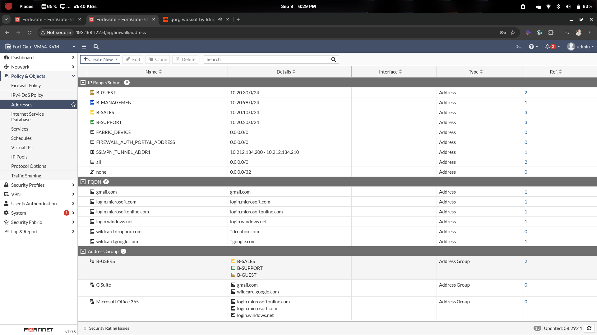

# Branch-B — Firewall Address Objects

## Overview

This document covers all **firewall address objects** and **address groups** created
on **FGT-BRANCH-B**. These objects are referenced in firewall policies to enforce
segmentation and control access between Branch B VLANs.

---

## Address Object Reference

| Object Name    | Subnet          | Description                     |
|----------------|-----------------|---------------------------------|
| `B-SALES`      | 10.20.10.0/24   | VLAN 110 — Sales department     |
| `B-SUPPORT`    | 10.20.20.0/24   | VLAN 120 — Support department   |
| `B-GUEST`      | 10.20.30.0/24   | VLAN 130 — Guest network        |
| `B-MANAGEMENT` | 10.20.99.0/24   | VLAN 199 — Management network   |

### Address Group

| Group Name | Members                            | Description                      |
|------------|------------------------------------|----------------------------------|
| `B-USERS`  | `B-SALES`, `B-SUPPORT`, `B-GUEST`  | All non-management user VLANs    |

---

## Configuration — CLI

### Individual Address Objects

```sh
config firewall address

    edit "B-SALES"
        set subnet 10.20.10.0 255.255.255.0
        set comment "VLAN110 - Sales department"
    next

    edit "B-SUPPORT"
        set subnet 10.20.20.0 255.255.255.0
        set comment "VLAN120 - Support department"
    next

    edit "B-GUEST"
        set subnet 10.20.30.0 255.255.255.0
        set comment "VLAN130 - Guest network"
    next

    edit "B-MANAGEMENT"
        set subnet 10.20.99.0 255.255.255.0
        set comment "VLAN199 - Management network"
    next

end
```

### Address Group

```sh
config firewall addrgrp

    edit "B-USERS"
        set member "B-SALES" "B-SUPPORT" "B-GUEST"
        set comment "Branch B user VLANs"
    next

end
```

---

## Verification

```sh
show firewall address
show firewall addrgrp
```

---

## Screenshots



---

## Milestone Checklist

| Check                               | Expected                   |
|-------------------------------------|----------------------------|
| `B-SALES` address object exists     | 10.20.10.0/255.255.255.0   |
| `B-SUPPORT` address object exists   | 10.20.20.0/255.255.255.0   |
| `B-GUEST` address object exists     | 10.20.30.0/255.255.255.0   |
| `B-MANAGEMENT` address object exists| 10.20.99.0/255.255.255.0   |
| `B-USERS` group has 3 members       | B-SALES, B-SUPPORT, B-GUEST|

---

## Next Step

→ *See: [`01-branch-b-firewall-policies.md`](../POLICIES/01-branch-b-firewall-policies.md)*
