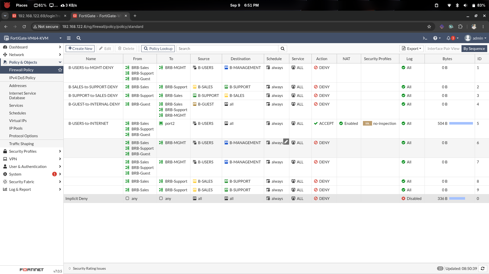

# Branch-B — Firewall Policies

## Overview

This document covers the **firewall policies** configured on **FGT-BRANCH-B**
to enforce VLAN segmentation and control Internet access.

Branch B has two policy categories:

1. **Isolation (deny) policies** — prevent user VLANs from accessing each other
   or the management VLAN
2. **Internet (NAT) policy** — allow user VLANs to reach the Internet via `port2`

---

## Branch B Interface Reference

| Interface    | VLAN | Subnet          | Gateway IP   |
|--------------|------|-----------------|--------------|
| `BRB-Sales`  | 110  | 10.20.10.0/24   | 10.20.10.1   |
| `BRB-Support`| 120  | 10.20.20.0/24   | 10.20.20.1   |
| `BRB-Guest`  | 130  | 10.20.30.0/24   | 10.20.30.1   |
| `BRB-MGMT`   | 199  | 10.20.99.0/24   | 10.20.99.1   |
| `port1`      | —    | 172.31.255.20/24| WAN / IPsec  |
| `port2`      | —    | DHCP            | Internet/NAT |

---

## Design — Traffic Policy Model

### Isolation (Denied by Explicit Policy + Implicit Deny)

```
Sales    ✗──►  Support
Support  ✗──►  Sales
Sales    ✗──►  Management
Support  ✗──►  Management
Guest    ✗──►  Sales
Guest    ✗──►  Support
Guest    ✗──►  Management
Guest    ✗──►  Branch A (via IPsec — future)
```

### Internet Access (Allowed)

```
Sales    ──►  port2  ──NAT──►  Internet   ✅
Support  ──►  port2  ──NAT──►  Internet   ✅
Guest    ──►  port2  ──NAT──►  Internet   ✅
Management  ─── No internet policy ──     ❌
```

---

## Policy 1 — Users → Management DENY

Users (Sales, Support, Guest) are blocked from reaching the management VLAN.

```sh
config firewall policy
    edit 0
        set name "B-USERS-to-MGMT-DENY"
        set srcintf "BRB-Sales" "BRB-Support" "BRB-Guest"
        set dstintf "BRB-MGMT"
        set srcaddr "B-USERS"
        set dstaddr "B-MANAGEMENT"
        set action deny
        set schedule "always"
        set service "ALL"
        set logtraffic all
    next
end
```

---

## Policy 2 — Sales → Support DENY

```sh
config firewall policy
    edit 0
        set name "B-SALES-to-SUPPORT-DENY"
        set srcintf "BRB-Sales"
        set dstintf "BRB-Support"
        set srcaddr "B-SALES"
        set dstaddr "B-SUPPORT"
        set action deny
        set schedule "always"
        set service "ALL"
        set logtraffic all
    next
end
```

---

## Policy 3 — Support → Sales DENY

Both directions are explicitly configured because firewall sessions are
**directional**. This also makes the deny visible in logs for both flows.

```sh
config firewall policy
    edit 0
        set name "B-SUPPORT-to-SALES-DENY"
        set srcintf "BRB-Support"
        set dstintf "BRB-Sales"
        set srcaddr "B-SUPPORT"
        set dstaddr "B-SALES"
        set action deny
        set schedule "always"
        set service "ALL"
        set logtraffic all
    next
end
```

---

## Policy 4 — Guest → Internal DENY

Guest is completely isolated from all internal VLANs.

```sh
config firewall policy
    edit 0
        set name "B-GUEST-to-INTERNAL-DENY"
        set srcintf "BRB-Guest"
        set dstintf "BRB-Sales" "BRB-Support" "BRB-MGMT"
        set srcaddr "B-GUEST"
        set dstaddr "all"
        set action deny
        set schedule "always"
        set service "ALL"
        set logtraffic all
    next
end
```

---

## Policy 5 — Users → Internet (NAT)

Sales, Support, and Guest may access the Internet via `port2`.
NAT is **enabled** because traffic exits to the public Internet.

```sh
config firewall policy
    edit 0
        set name "B-USERS-to-INTERNET"
        set srcintf "BRB-Sales" "BRB-Support" "BRB-Guest"
        set dstintf "port2"
        set srcaddr "B-USERS"
        set dstaddr "all"
        set action accept
        set schedule "always"
        set service "ALL"
        set nat enable
        set logtraffic all
    next
end
```

> ✅ **NAT is ON here** because traffic exits to the Internet.  
> ❌ NAT must remain **OFF** for all internal VLAN-to-VLAN traffic.

---

## Policy Table Summary

| # | Name                      | Src            | Dst        | Action | NAT |
|---|---------------------------|----------------|------------|--------|-----|
| 1 | B-USERS-to-MGMT-DENY      | Sales/Support/Guest | BRB-MGMT | deny | —  |
| 2 | B-SALES-to-SUPPORT-DENY   | BRB-Sales      | BRB-Support| deny   | —   |
| 3 | B-SUPPORT-to-SALES-DENY   | BRB-Support    | BRB-Sales  | deny   | —   |
| 4 | B-GUEST-to-INTERNAL-DENY  | BRB-Guest      | Internal   | deny   | —   |
| 5 | B-USERS-to-INTERNET       | Sales/Support/Guest | port2 | accept | On |
|   | *(implicit)*              | any            | any        | deny   | —   |

---

## Verification

```sh
# View all Branch B policies
show firewall policy

# Test Internet from Sales host
ping -c 4 8.8.8.8

# Test denied flows
ping -c 4 10.20.20.1   # Sales → Support gateway — should fail
ping -c 4 10.20.99.1   # Sales → Management — should fail
```

---

## Screenshots



---

## Milestone Checklist

| Check                                      | Expected            |
|--------------------------------------------|---------------------|
| Policy B-USERS-to-MGMT-DENY exists         | Action: deny        |
| Policy B-SALES-to-SUPPORT-DENY exists      | Action: deny        |
| Policy B-SUPPORT-to-SALES-DENY exists      | Action: deny        |
| Policy B-GUEST-to-INTERNAL-DENY exists     | Action: deny        |
| Policy B-USERS-to-INTERNET exists          | NAT on, action accept|
| Sales can reach 8.8.8.8                    | 0% packet loss      |
| Sales cannot reach Support (10.20.20.x)    | 100% packet loss    |
| Guest cannot reach Sales (10.20.10.x)      | 100% packet loss    |
| Any user cannot reach Management (10.20.99.x)| 100% packet loss  |

---

## Next Step

→ *See: [`docs/02-topology-setup/IPSEC-VPN/01-ipsec-phase1-config.md`](../../02-topology-setup/IPSEC-VPN/01-ipsec-phase1-config.md)*
